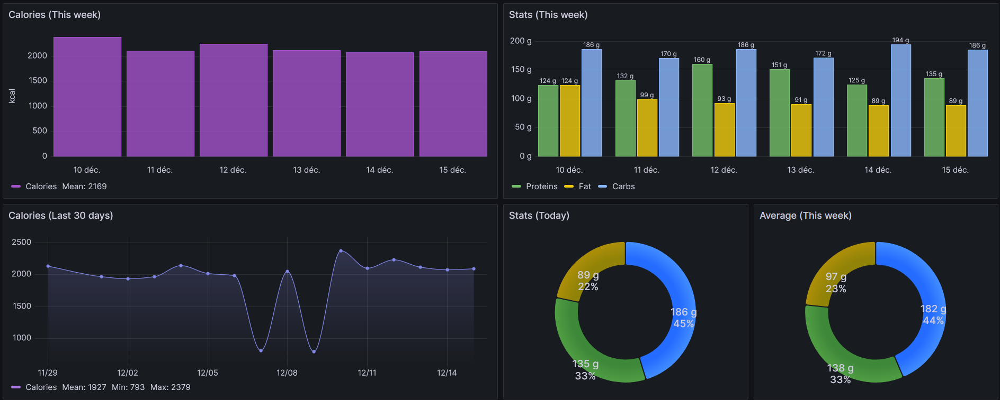

#  Waistline API

External data collection service from [Waistline](https://github.com/davidhealey/waistline/).<br/>
This API is designed to receive data from the app thanks to the "Data sharing" feature.

It's built with Symfony, Postgres, and MongoDB.

I created this service to centralize all my statistics from Waistline and be able to consult my data from an API endpoint.<br/>
This endpoint allows me to visualize my stats in a Grafana dashboard. 



## Links
- [Documentation]() — Learn how to use Waistline API (Will come soon...)
- [Docker Hub](https://hub.docker.com/r/waistlineapi/waistline-api) — Find all docker images

## Installation

### Docker Compose [Recommended]

#### Step 1 - Download the required files
Create a directory of your choice (e.g. `./waistline-api`) to hold the `docker-compose.yml` and `.env.local` files.

```bash title="Move to the directory you created"
mkdir waistline-api
cd ./waistline-api
```
Download `docker-compose.yml` and `.env` by running the following commands:

```bash title="Get docker-compose.yml file"
wget https://raw.githubusercontent.com/hippothomas/waistline-api/master/docker-compose.yml
```

```bash title="Get .env file"
wget -O .env.local https://raw.githubusercontent.com/hippothomas/waistline-api/master/.env
```

#### Step 2 - Populate the .env file with custom values
You should change these values for security reason:
```dotenv
APP_ENV= # Set it to "prod"
APP_SECRET= # You should generate a new app secret
APP_BASE_URL= # The url of the app (without the ending /)
DATABASE_URL= # Your database connection string
MONGODB_URL= # Your mongodb connection string
```
You should also change the values in consequence in the `docker-compose.yml`.

#### Step 3 - Start the containers
From the directory you created in Step 1, run:

```bash title="Start the containers using docker compose command"
docker compose up -d
```

#### Step 4 - Execute migrations
Once the containers are up and running, you may have to execute these commands to instantiate the database and reset the cache:

```shell
docker exec -it waistline-api /bin/sh
php bin/console doctrine:migrations:migrate --quiet
php bin/console cache:clear --quiet
exit
```

## Contributing
Contributions, suggestions, bug reports and fixes are welcome!

For new features, filters, or endpoints, please open an issue and discuss before sending a PR.

## License
See the [LICENSE](LICENSE.md) file for license rights and limitations (MIT).
