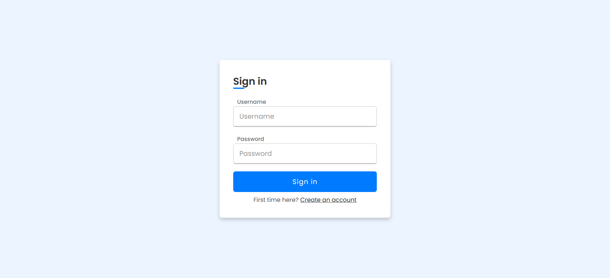
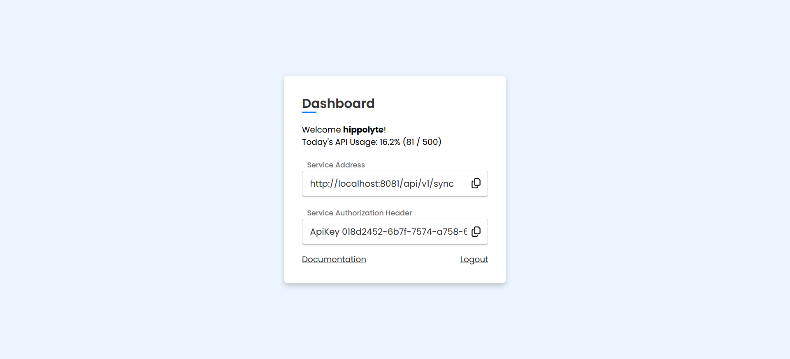

#  Dashboard

Once you installed your application, you should be able to access it from the url you chose.

You should arrive on the login page:

You can create an account with the link on the bottom of the page and then connect to your dashboard with your account. 

The dashboard looks like this:

Here you can find all the information you need:
<ul>
	<li>Your current API usage</li>
	<li>The service address for the Data sharing configuration</li>
	<li>The service API key</li>
</ul>
See the [Synchronise your mobile app](synchronise.md) page to connect your Waistline mobile application to the API.
