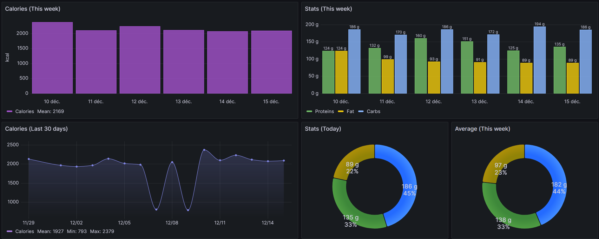

#  Waistline API

External data collection service from [Waistline](https://github.com/davidhealey/waistline/). 
This API is designed to receive data from the app thanks to the "Data sharing" feature.

It's built with Symfony, Postgres, and MongoDB.

I created this service to centralize all my statistics from Waistline and be able to consult my data from an API endpoint. 
This endpoint allows me to visualize my stats in a Grafana dashboard. 

