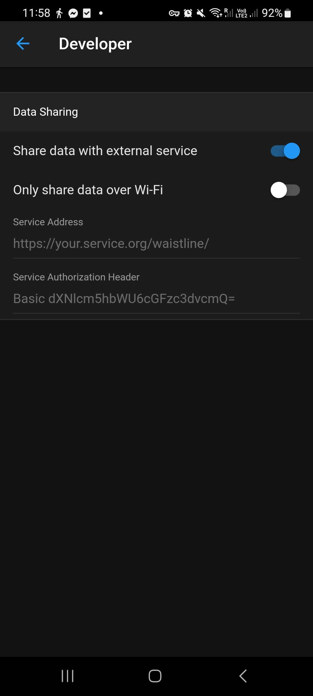

#  Synchronise your mobile app

## Data Sharing Configuration
To receive data from the [Waistline mobile app](https://github.com/davidhealey/waistline/), you have to configure the app to automatically synchronise with the API.

To do that, you have to go in the application "Settings", there is a section named "Developer".

You should see this page:

Here, you have to activate the option "Share data with external service".

Then you can fill the fields "Service Address" and "Service Authorization Header" with the information visible on your [Dashboard](dashboard.md).

You could then exit the page, it will be saved automatically.

## How does it work?

Every time you make a modification in your Diary or that you just "scroll" between days of your Diary, it makes a request with all the diary's data of the current day you look.
This data is then saved in the database of the API, and you can consult it thanks to the [API's endpoints](api-documentation/index.md).
